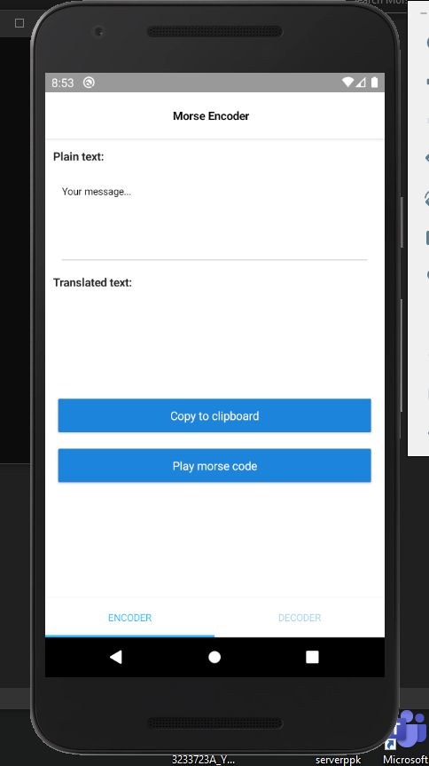
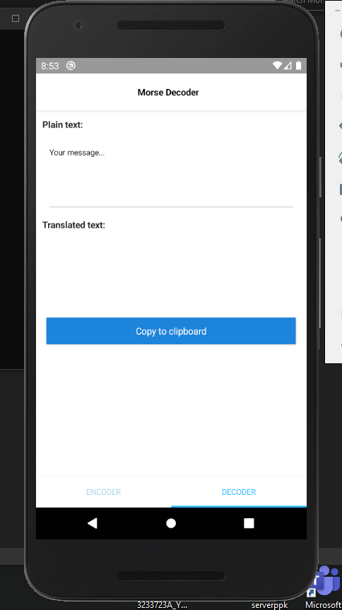

# MorseCodeTranslator_nativescript

This is a morse code encoder/decoder app for android and ios made in nativescript 7 and angular.
It can play the morse code using the flashlight and speakers of your phone.

That's it... just a simple app in nativescript. :)

